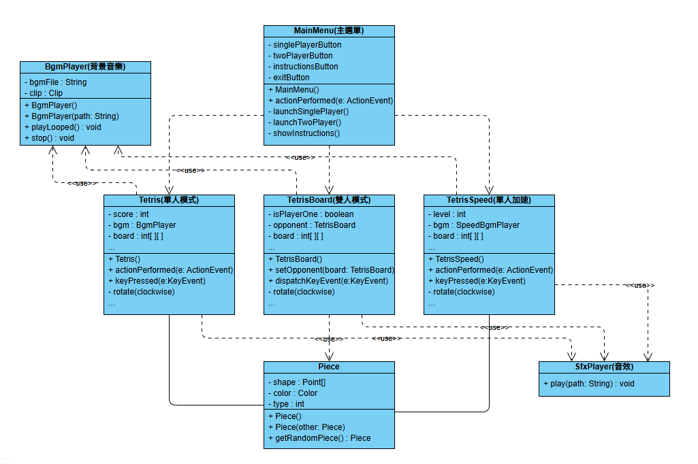
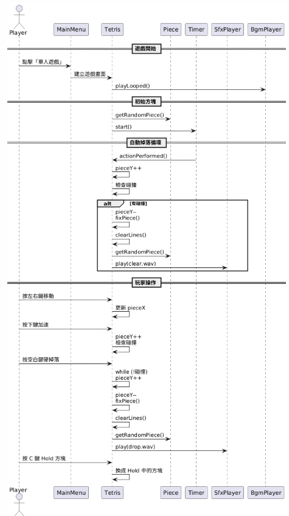

# 2025 JAVA 俄羅斯方塊
- 學號：B11107160 姓名：黃正亮  
學號：B11130028 姓名：李哲
- 分工說明：  
  - 黃正亮：  
    - 主選單
    - 單人/雙人模式
    - 音樂檔之副程式
    - 影片說明及報告
  - 李哲：  
    - 音樂檔下載
    - 單人加速模式
    - Hold與預覽
- [報告影片連結](https://youtu.be/C0phs0lIFFk)
## 遊戲說明
**遊戲中的說明都有註記，以下簡單帶過**
### 模式介紹
- 單人模式
- 加速模式
- 雙人模式
### 操作說明
- 單人/加速模式  
←→：左右移動  
↓：加速下降  
↑：順時針旋轉  
/：逆時針旋轉  
c：Hold  
Space：硬掉落  
P：暫停  
- 雙人模式  
AD | ←→：左右移動  
S | ↓：加速下降  
W | ↑：順時針旋轉  
E | /：逆時針旋轉  
C | ,：Hold  
X | .：硬掉落
## 執行檔說明
直接執行Tetris資料夾中的Tetris.jar即可

# 流程圖

# UML類別圖

# 時序圖

